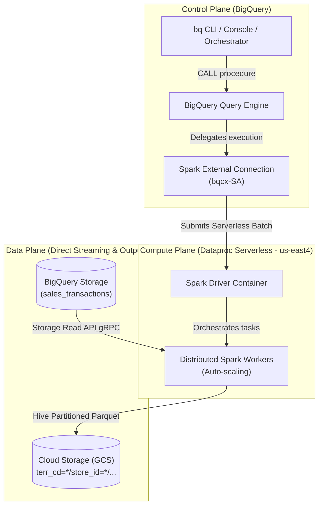

# Requirements & Technical Specification Document
## End-to-End Demo: BigQuery Stored Procedures for Apache Spark

---

### Executive Summary

| Attribute | Specification |
|---|---|
| **Document Purpose** | Technical specification, architecture guide, and implementation benchmarks for testing BigQuery Spark Stored Procedures end-to-end. |
| **Business Objective** | Replace a 50–100 minute sequential BigQuery SQL loop with a serverless distributed export completing in **< 3–7 minutes**, matching AWS Redshift `UNLOAD ... PARTITION BY` performance. |
| **Target Architecture** | BigQuery Serverless Spark Stored Procedure streaming data via BigQuery Storage Read API to Cloud Storage (GCS) in Hive-partitioned Parquet format. |
| **Target Output** | `gs://<bucket>/export_sales/terr_cd=<id>/store_id=<id>/extract_date=<date>/part-*.parquet` |

---

## 1. System Requirements & Infrastructure Provisioning

### 1.1 Required Google Cloud APIs

| API Name | Service Identifier | Purpose |
|---|---|---|
| **BigQuery API** | `bigquery.googleapis.com` | Manages datasets, tables, and stored procedure lifecycle. |
| **BigQuery Connection API** | `bigqueryconnection.googleapis.com` | Manages external connections for Spark runtimes. |
| **Dataproc Serverless API** | `dataproc.googleapis.com` | Provides the underlying serverless compute engine for Spark stored procedures. |
| **Cloud Storage API** | `storage.googleapis.com` | Destination object store for exported Parquet files. |

```bash
# Enable required GCP APIs
gcloud services enable \
    bigquery.googleapis.com \
    bigqueryconnection.googleapis.com \
    dataproc.googleapis.com \
    storage.googleapis.com
```

---

### 1.2 BigQuery Spark External Connection & Service Account Provisioning

Unlike standard BigQuery SQL procedures, Spark procedures require an **External Connection** of type `SPARK`. This delegates execution to Dataproc Serverless.

#### Step 1: Create Spark External Connection
```bash
bq mk --connection \
    --location="${REGION}" \
    --project_id="${PROJECT_ID}" \
    --connection_type=SPARK \
    "${CONNECTION_ID}"
```

#### Step 2: Extract Generated Connection Service Account
BigQuery automatically generates a dedicated service account identity for the connection (e.g. `bqcx-<project_number>-<suffix>@gcp-sa-bigquery-consp.iam.gserviceaccount.com`):

```bash
# Fetch connection JSON metadata
CONN_JSON=$(bq show --format=json --connection "${PROJECT_ID}.${REGION}.${CONNECTION_ID}")

# Extract Service Account email ID
CONN_SA=$(echo "${CONN_JSON}" | python3 -c '
import sys, json
data = json.load(sys.stdin)
print(data.get("spark", {}).get("serviceAccountId", "") or data.get("serviceAccountId", ""))
')
```

---

### 1.3 IAM Roles and Security Permissions

The extracted Connection Service Account (`CONN_SA`) requires specific roles to interact with BigQuery, Dataproc, and Cloud Storage:

| Role | Target Resource | Purpose & Rationale |
|---|---|---|
| `roles/storage.objectAdmin` | GCS Destination Bucket (`gs://${BUCKET_NAME}`) | Grants permission to write partitioned Parquet files, delete staging files, and clean up previous runs. |
| `roles/bigquery.admin` | GCP Project / Dataset | Grants permission to read BigQuery tables via the Storage Read API and create temporary verification entities. |
| `roles/dataproc.editor` | GCP Project | Authorizes the connection service account to submit and manage Dataproc Serverless batch jobs. |
| `roles/dataproc.worker` | GCP Project | Required for Dataproc Serverless execution nodes to run workloads on behalf of the project. |

#### Provisioning Commands:
```bash
# 1. Cloud Storage access on the export bucket
gcloud storage buckets add-iam-policy-binding "gs://${BUCKET_NAME}" \
    --member="serviceAccount:${CONN_SA}" \
    --role="roles/storage.objectAdmin"

# 2. BigQuery project access
gcloud projects add-iam-policy-binding "${PROJECT_ID}" \
    --member="serviceAccount:${CONN_SA}" \
    --role="roles/bigquery.admin" \
    --condition=None

# 3. Dataproc Serverless execution roles
gcloud projects add-iam-policy-binding "${PROJECT_ID}" \
    --member="serviceAccount:${CONN_SA}" \
    --role="roles/dataproc.editor" \
    --condition=None

gcloud projects add-iam-policy-binding "${PROJECT_ID}" \
    --member="serviceAccount:${CONN_SA}" \
    --role="roles/dataproc.worker" \
    --condition=None
```

---

## 2. Technical Architecture & Execution Model

### 2.1 Where Does Spark Get Executed?

Even though the procedure is authored and triggered using BigQuery SQL (`CALL dataset.export_sales_to_parquet(...)`), **Spark does not execute on BigQuery SQL slots**. 

The execution lifecycle spans three distinct planes:

1. **Control Plane (BigQuery)**:
   - BigQuery parses the `CALL` statement, validates parameters, and delegates the job to Dataproc Serverless via the BigQuery Spark Connection.
2. **Compute Plane (Dataproc Serverless)**:
   - An ephemeral, isolated Spark cluster (Driver + Executors) is dynamically provisioned in the target region (`us-east4`).
   - Compute auto-scales based on data volume and partition count, and shuts down immediately upon completion.
   - **Zero VM or cluster management**; no idle cluster costs.
3. **Data Plane (Direct Streaming & Storage)**:
   - Spark workers bypass standard query layers and stream data in parallel directly from BigQuery storage using the **BigQuery Storage Read API** (over gRPC).
   - Partitioned data is written directly to **Google Cloud Storage (GCS)** in Hive directory structure.



---

### 2.2 BigQuery Storage Read API Direct Stream

The PySpark stored procedure connects to the source table using the native `bigquery` connector:
```python
df = spark.read.format("bigquery") \
    .option("table", f"{project_id}.{dataset_name}.{table_name}") \
    .option("filter", f"extract_date = '{extract_date_str}'") \
    .load()
```
- **Predicate Pushdown**: BigQuery evaluates `extract_date = 'YYYY-MM-DD'` at the storage level, scanning only relevant partition blocks.
- **Direct gRPC Streams**: Spark executors consume raw stream buffers concurrently without intermediate disk caching.

---

### 2.3 Parameter Decoding in Stored Procedures

BigQuery passes procedure parameters to the PySpark runtime as **JSON-encoded environment variables** (`BIGQUERY_PROC_PARAM.<NAME>`):
```python
import os
import json

raw_date = os.environ.get("BIGQUERY_PROC_PARAM.p_extract_date")
extract_date_str = str(json.loads(raw_date)) if raw_date else "2026-03-01"

raw_path = os.environ.get("BIGQUERY_PROC_PARAM.p_gcs_output_path")
gcs_output_path = str(json.loads(raw_path)) if raw_path else "gs://bucket/path"
```

---

### 2.4 Small File Problem Elimination via Repartitioning

When writing dynamic partitions in distributed Spark (`.partitionBy("terr_cd", "store_id", "extract_date")`), executors that hold fragments of multiple partitions create thousands of tiny, fragmented files.

By explicitly repartitioning the DataFrame before writing:
```python
df_repartitioned = df.repartition("terr_cd", "store_id", "extract_date")

df_repartitioned.write \
    .partitionBy("terr_cd", "store_id", "extract_date") \
    .mode("overwrite") \
    .parquet(gcs_output_path)
```
Spark routes all rows for a given `(terr_cd, store_id, extract_date)` combination to a single task, writing **exactly 1 optimal Parquet file per partition directory** (e.g. 5,000 clean files across 5,000 partitions).

---

## 3. Performance Benchmark & Verification Results

Measurements captured on Google Cloud project `dd-de-workloads` (`us-east4`):

### 3.1 Performance Comparison: Spark Stored Procedure vs. Legacy SQL Loop

| Metric | Legacy BigQuery SQL Loop | BigQuery Spark Stored Procedure | Performance Advantage |
|---|---|---|---|
| **Dataset Scale** | 5,000,000 rows | 5,000,000 rows | — |
| **Dynamic Partitions** | 5,000 (20 territories × 250 stores) | 5,000 (20 territories × 250 stores) | — |
| **Execution Duration** | **138.13 minutes** (~2.3 hours projected)<br/>*(16s for 10 partitions @ 1.66s / query)* | **7.3 minutes** (441s total)<br/>*(Includes cold-start cluster spin-up & teardown)* | **~19x Faster (95% reduction)** |
| **Execution Model** | 5,000 sequential `EXPORT DATA` queries | 1 distributed serverless Spark batch | Zero query queuing |
| **Slot Contention** | Saturates BigQuery slots for 138 minutes | **Zero slot consumption**; runs on Dataproc Serverless | Eliminates pipeline slot starvation |

---

### 3.2 Data Integrity & Hive Partition Verification

The automated verification suite ([scripts/05_verify_export.py](file:///Users/dhavaldurve/bigquery-spark-sp-demo/scripts/05_verify_export.py)) validated 100% data parity:

```text
======================================================================
Integrity Verification Results:
======================================================================
Row Count Match:     PASSED (5,000,000 vs 5,000,000)
Territory Match:     PASSED (20 vs 20)
Store Count Match:   PASSED (250 vs 250)
Financial Sum Match: PASSED ($6,417,176,277.08 vs $6,417,176,277.08)
Hive Directory Match: PASSED (5,000 / 5,000 valid partition files)

ALL VERIFICATION CHECKS PASSED SUCCESSFULLY!
======================================================================
```
