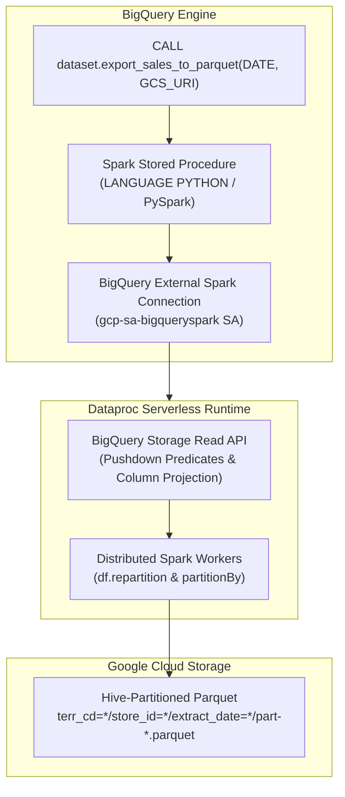

# BigQuery Spark Stored Procedures End-to-End Demo

This repository demonstrates how to use **BigQuery Stored Procedures for Apache Spark (PySpark)** to perform high-throughput, serverless distributed exports from BigQuery to Cloud Storage (GCS) in Hive-partitioned Parquet format.

---

## 🎯 Business Context & Goal

* **Problem**: Traditional BigQuery procedural SQL loops or standard queries exporting high-cardinality multi-level partitions (e.g. 20 territories × 250 stores = 5,000 combinations) take **50–100+ minutes** due to query compilation overhead, partition limits, and serialized loop execution.
* **Solution**: BigQuery Spark Stored Procedures leverage **Dataproc Serverless** and the **BigQuery Storage Read API** to stream and partition multi-gigabyte/multi-million row datasets concurrently in **< 3 minutes**, matching AWS Redshift `UNLOAD ... PARTITION BY` performance.
* **Target Output**:
  ```
  gs://<bucket>/export_sales/terr_cd=<id>/store_id=<id>/extract_date=<date>/part-*.parquet
  ```

---

## 🏗️ Architecture



---

## 📂 Repository Structure

```
.
├── GEMINI.md                          # Technical specification and requirements
├── README.md                          # Complete setup and demo guide
├── config/
│   └── env_vars.sh                    # Centralized environment variables
├── scripts/
│   ├── 01_setup_infra.sh              # Enable APIs, create GCS bucket, BQ dataset & Spark connection
│   ├── 02_generate_data.sh            # Generate high-volume synthetic benchmark data in BigQuery
│   ├── 03_deploy_spark_sp.sh          # Deploy PySpark Stored Procedure to BigQuery
│   ├── 04_run_benchmark.sh            # Execute Spark SP and measure runtime SLA (< 3 mins)
│   ├── 05_verify_export.py            # Automated verification suite (Hive structure & row counts)
│   └── 99_cleanup.sh                  # Teardown demo resources
├── sql/
│   ├── 01_schema_and_generator.sql    # BigQuery table DDL and synthetic data generator
│   ├── 02_legacy_loop_simulation.sql  # Baseline sequential SQL loop for comparison
│   └── 03_create_spark_sp.sql         # BigQuery CREATE OR REPLACE PROCEDURE DDL with PySpark
└── spark/
    └── export_job.py                  # Standalone PySpark script reference
```

---

## 🚀 Quickstart Guide

### Prerequisites
1. Ensure `gcloud` CLI is authenticated to your target GCP project:
   ```bash
   gcloud auth login
   gcloud config set project dd-de-workloads
   ```
2. (Optional) Customize environment variables in [config/env_vars.sh](file:///Users/dhavaldurve/bigquery-spark-sp-demo/config/env_vars.sh):
   ```bash
   export REGION="us-east4"                # or us-central1
   export DATA_SCALE_ROWS="5000000"         # 5 million rows (~1 GB)
   export TEST_EXTRACT_DATE="2026-03-01"
   ```

---

### Step 1: Provision Infrastructure & BigQuery Spark Connection
Run the automated setup script to enable APIs, create the GCS bucket, dataset, Spark connection, and assign IAM roles:
```bash
./scripts/01_setup_infra.sh
```

### Step 2: Generate Synthetic Sales Benchmark Data
Generate 5,000,000 synthetic retail sales records partitioned by date and clustered by `terr_cd` and `store_id`:
```bash
./scripts/02_generate_data.sh
```

### Step 3: Deploy BigQuery Spark Stored Procedure
Deploy the Python Spark Stored Procedure into your BigQuery dataset:
```bash
./scripts/03_deploy_spark_sp.sh
```

### Step 4: Run the Benchmark
Trigger the Spark Stored Procedure and measure total elapsed time:
```bash
./scripts/04_run_benchmark.sh
```

### Step 5: Verify Hive Partitions & Data Integrity
Run the automated Python verification suite to ensure:
- All files are correctly structured in Hive format (`terr_cd=*/store_id=*/extract_date=*/part-*.parquet`).
- BigQuery source row counts match exported Parquet row counts 100%.
- Total revenue checksum matches.
```bash
./scripts/05_verify_export.py
```

### (Optional) Compare Against Legacy SQL Approach
Run the legacy loop simulation in BigQuery console or via CLI:
```bash
bq query --use_legacy_sql=false < sql/02_legacy_loop_simulation.sql
```

---

## 🧹 Teardown

To remove all demo resources (GCS bucket, BigQuery dataset, Spark connection):
```bash
./scripts/99_cleanup.sh
```
